# Дополнительные диаграммы MSE Telegram Bot

## Архитектурная диаграмма системы

```mermaid
graph TB
    subgraph "🤖 Telegram Bot Layer"
        TG[Telegram Bot API]
        CMD[Система команд]
        MSG[Обработчик сообщений]
        CB[Callback обработчик]
    end
    
    subgraph "📋 Команды"
        START[/start - Регистрация]
        SURVEY[/survey - Опрос]
        STATS[/stats - Статистика]
        SETTINGS[/settings - Настройки]
        EXPORT[/export - Экспорт]
        HELP[/help - Помощь]
    end
    
    subgraph "🧠 Валидация и ИИ"
        MV[MomentValidator<br/>Базовая валидация]
        GS[GoldenStandard<br/>Эталонные примеры]
        AI[AI Validator Service<br/>OpenAI/Anthropic]
        FU[FollowUp Strategy<br/>Дополнительные вопросы]
    end
    
    subgraph "⚙️ Сервисы"
        NS[NotificationScheduler<br/>Планировщик уведомлений]
        TS[TrainingService<br/>Управление обучением]
        DE[DataExporter<br/>Экспорт данных]
        DB[Database Service<br/>MongoDB подключение]
    end
    
    subgraph "📊 Модели данных"
        USER[(User<br/>Пользователи)]
        RESP[(Response<br/>Ответы на опросы)]
        TRAIN[(TrainingProgress<br/>Прогресс обучения)]
    end
    
    subgraph "📈 Мониторинг"
        METRICS[Система метрик]
        HEALTH[Health Check]
        LOGS[Логирование]
    end
    
    subgraph "🔧 Конфигурация"
        HURLBURT[hurlburt.js<br/>Настройки метода]
        GOLDEN[golden-examples.js<br/>Эталонные примеры]
        ENV[.env<br/>Переменные окружения]
    end
    
    %% Connections
    TG --> CMD
    TG --> MSG
    TG --> CB
    
    CMD --> START
    CMD --> SURVEY
    CMD --> STATS
    CMD --> SETTINGS
    CMD --> EXPORT
    CMD --> HELP
    
    SURVEY --> MV
    MV --> GS
    GS --> AI
    AI --> FU
    
    START --> USER
    SURVEY --> RESP
    SURVEY --> TRAIN
    STATS --> RESP
    SETTINGS --> USER
    EXPORT --> DE
    
    NS --> USER
    TS --> TRAIN
    DE --> RESP
    DB --> USER
    DB --> RESP
    DB --> TRAIN
    
    MV --> HURLBURT
    GS --> GOLDEN
    AI --> ENV
    NS --> ENV
    
    SURVEY --> METRICS
    AI --> METRICS
    NS --> METRICS
    
    HEALTH --> USER
    HEALTH --> RESP
    HEALTH --> TRAIN
    HEALTH --> AI
    
    %% Styling
    classDef botLayer fill:#e3f2fd
    classDef commands fill:#f3e5f5
    classDef validation fill:#fce4ec
    classDef services fill:#e8f5e8
    classDef data fill:#fff3e0
    classDef monitoring fill:#f1f8e9
    classDef config fill:#fafafa
    
    class TG,CMD,MSG,CB botLayer
    class START,SURVEY,STATS,SETTINGS,EXPORT,HELP commands
    class MV,GS,AI,FU validation
    class NS,TS,DE,DB services
    class USER,RESP,TRAIN data
    class METRICS,HEALTH,LOGS monitoring
    class HURLBURT,GOLDEN,ENV config
```

## Диаграмма пользовательского пути

```mermaid
flowchart TD
    A[👤 Новый пользователь] --> B[/start - Регистрация]
    B --> C{Пользователь создан?}
    C -->|Да| D[📋 Приветственное сообщение]
    C -->|Нет| E[❌ Ошибка регистрации]
    
    D --> F[⚙️ Настройка уведомлений]
    F --> G[📚 Обучающие материалы]
    G --> H[🎯 Начало 3-дневного обучения]
    
    H --> I[📱 Получение уведомления]
    I --> J{Ответил в течение часа?}
    J -->|Нет| K[🔔 Эскалация уведомлений]
    K --> L{Достигнут максимум эскалации?}
    L -->|Да| M[😴 Пауза до следующего дня]
    L -->|Нет| N[📢 Повторное уведомление]
    N --> J
    
    J -->|Да| O[📝 Начало опроса]
    O --> P[💭 Вопрос о текущем моменте]
    P --> Q[✍️ Ответ пользователя]
    Q --> R[🤖 ИИ-валидация ответа]
    
    R --> S{Качество ответа}
    S -->|Низкое < 40%| T[📖 Обучающая обратная связь]
    S -->|Среднее 40-70%| U[💡 Конструктивные советы]
    S -->|Высокое > 70%| V[🎉 Позитивная обратная связь]
    
    T --> W{Нужен follow-up?}
    U --> W
    V --> W
    
    W -->|Да| X[❓ Дополнительный вопрос]
    X --> Y[✍️ Ответ на follow-up]
    Y --> Z[📊 Обновление метрик]
    
    W -->|Нет| Z
    Z --> AA[📈 Расчет прогресса дня]
    
    AA --> BB{Завершен день обучения?}
    BB -->|Нет| CC[⏰ Планирование следующего опроса]
    CC --> I
    
    BB -->|Да| DD{Все 3 дня завершены?}
    DD -->|Нет| EE[🌅 Переход к следующему дню]
    EE --> FF[📊 Анализ прогресса]
    FF --> GG[🎯 Корректировка стратегии]
    GG --> I
    
    DD -->|Да| HH[🎓 Завершение обучения]
    HH --> II[📋 Итоговая оценка]
    II --> JJ[📊 Персональная статистика]
    JJ --> KK[📤 Экспорт данных]
    
    KK --> LL[🔄 Переход в режим исследования]
    LL --> MM[📱 Регулярные опросы]
    MM --> NN[📈 Долгосрочная статистика]
    
    M --> OO[📅 Новый день]
    OO --> I
    
    style A fill:#e1f5fe
    style H fill:#f3e5f5
    style HH fill:#e8f5e8
    style KK fill:#fff3e0
    style R fill:#fce4ec
    style T fill:#ffebee
    style V fill:#e8f5e8
```

## Диаграмма состояний обучения

```mermaid
stateDiagram-v2
    [*] --> Регистрация
    Регистрация --> НастройкаУведомлений
    НастройкаУведомлений --> День1
    
    state "3-дневное обучение" as Обучение {
        День1 --> День2 : Завершен день 1
        День2 --> День3 : Завершен день 2
        День3 --> Выпуск : Завершен день 3
        
        state День1 {
            [*] --> ОжиданиеУведомления1
            ОжиданиеУведомления1 --> Опрос1 : Уведомление
            Опрос1 --> Валидация1 : Ответ
            Валидация1 --> ОбратнаяСвязь1 : Анализ
            ОбратнаяСвязь1 --> ОжиданиеУведомления1 : Продолжить
            ОбратнаяСвязь1 --> [*] : День завершен
        }
        
        state День2 {
            [*] --> ОжиданиеУведомления2
            ОжиданиеУведомления2 --> Опрос2 : Уведомление
            Опрос2 --> Валидация2 : Ответ
            Валидация2 --> ОбратнаяСвязь2 : Анализ
            ОбратнаяСвязь2 --> ОжиданиеУведомления2 : Продолжить
            ОбратнаяСвязь2 --> [*] : День завершен
        }
        
        state День3 {
            [*] --> ОжиданиеУведомления3
            ОжиданиеУведомления3 --> Опрос3 : Уведомление
            Опрос3 --> Валидация3 : Ответ
            Валидация3 --> ОбратнаяСвязь3 : Анализ
            ОбратнаяСвязь3 --> ОжиданиеУведомления3 : Продолжить
            ОбратнаяСвязь3 --> [*] : День завершен
        }
    }
    
    Выпуск --> Исследование : Обучение завершено
    
    state Исследование {
        [*] --> РегулярныеОпросы
        РегулярныеОпросы --> АнализДанных : Накопление данных
        АнализДанных --> РегулярныеОпросы : Продолжить
        АнализДанных --> ЭкспортДанных : По запросу
        ЭкспортДанных --> РегулярныеОпросы
    }
    
    Исследование --> [*] : Завершение участия
```


